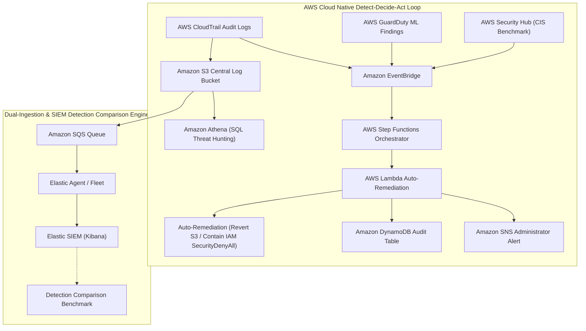

# Cloud-Native Security Monitoring & Automated Threat Response System

## Real-Time Threat Detection & Incident Automation on AWS

### 1. What This Project Is About

For my internship project, I built a **Cloud-Native Security Monitoring & Automated Threat Response Platform** on AWS. The idea came from a real problem I noticed: most security teams rely on SIEM systems that batch-ingest logs every 5–15 minutes, which means an attacker can create a backdoor account, exfiltrate data, or expose an S3 bucket — and no one gets notified until it's too late.

So I set out to build something different. The platform captures security events from across AWS infrastructure, routes high-risk threats through a serverless automation pipeline in **under 10 seconds**, automatically remediates them where possible, stores everything in a queryable database, and runs alongside an Elastic SIEM for comparison. All infrastructure is defined in Terraform and operates within AWS Free Tier — **$0.00 total spend**.

### 2. Problem Statement

**Cloud migration has expanded the enterprise attack surface — and attackers exploit API noise to navigate undetected.**

When organizations move workloads to AWS, traditional perimeter defenses stop working. Attacking a cloud environment doesn't usually require sophisticated exploits — attackers just need a leaked access key or an over-privileged IAM role, then they quietly use AWS API calls that look like normal administrative activity.

A typical cloud breach unfolds like this:

1. **Initial Access**: An attacker gets hold of an AWS access key or a phished IAM credential.
2. **Reconnaissance**: They run quiet IAM enumeration commands (`ListUsers`, `ListRoles`, `GetAccountAuthorizationDetails`) to map out what they can access.
3. **Persistence & Privilege Escalation**: They create a backdoor IAM user (`CreateUser`) and immediately grant it admin rights (`AttachUserPolicy` with `AdministratorAccess`).
4. **Data Exfiltration / Exposure**: They bulk-download sensitive S3 objects (`GetObject`) or flip a bucket policy to make it publicly accessible (`PutBucketPolicy` with `Principal: *`).

The entire sequence can happen in under five minutes. The problem is that if your only defense is a SIEM polling logs every few minutes, you're already behind by the time an alert fires. The goal of this project was to close that gap.

### 3. Solution Architecture & Operational Flow

The platform runs two parallel tracks:

#### How It Works

1. **AWS Native Detect-Decide-Act Loop**:
   - CloudTrail captures every API call. EventBridge watches for specific threat patterns (`PutBucketPolicy`, `CreateUser` followed by admin policy attach, GuardDuty findings) and triggers a Step Functions state machine.
   - The state machine enriches the event context and hands it to Lambda, which auto-remediates in seconds — re-blocking public S3 access or attaching a `SecurityDenyAll` policy to contain a backdoor IAM account.
   - Everything gets logged to DynamoDB and an SNS alert fires to the administrator email.
   - Athena provides a SQL threat hunting layer over the raw CloudTrail logs stored in S3.

2. **Dual-Ingestion & SIEM Benchmark**:
   - CloudTrail logs simultaneously stream into S3 → SQS → Elastic Agent → Elastic SIEM, running custom KQL detection rules in parallel.
   - Both tracks feed an empirical benchmark comparing detection latency, precision, and maintenance overhead between the AWS-native serverless path and the SIEM-based path.

---

### 4. AWS Services Used & Why I Chose Them

| Service | Role | Cost | Why This Service |
| :--- | :--- | :--- | :--- |
| **AWS CloudTrail** | Multi-Region API Audit Logging | Free Tier | Native audit trail — captures every management and data API call across the account. |
| **Amazon S3** | Central Log Repository | Free Tier | Durable, encrypted log landing zone with zero idle compute cost. |
| **Amazon EventBridge** | Real-Time Threat Event Router | Free Tier | Sub-second JSON pattern matching for CloudTrail threat calls & GuardDuty findings. |
| **AWS Step Functions** | Pipeline Orchestrator | Free Tier | State machine that visually coordinates the `Detect → Enrich → Decide → Remediate` flow. |
| **AWS Lambda** | Auto-Remediation Handler | Free Tier | Event-driven Python handler for S3 policy reversion, IAM containment, and DynamoDB logging. |
| **Amazon SNS** | Alert Notification | Free Tier | Delivers formatted security alerts to administrator email. |
| **Amazon DynamoDB** | Telemetry Audit Table | Free Tier | Stores pipeline alert history — low-latency with $0 idle cost. |
| **Amazon Athena** | SQL Log Analytics | Pay-per-query ($0 idle) | Instant SQL queries over CloudTrail archives in S3 — no cluster to manage. |
| **Amazon SQS** | SIEM Ingestion Queue | Free Tier | Decoupled queue that smooths out log volume spikes for Elastic Agent consumption. |
| **Amazon CloudWatch** | Health Monitoring | Free Tier | Monitors SQS depth, Lambda error rates, and pipeline execution health. |
| **AWS GuardDuty** | ML Threat Detection | 30-day Trial | ML anomaly detector — evaluated against custom EventBridge rules for a fair comparison. |
| **AWS Security Hub** | CIS Benchmark Scanner | 30-day Trial | Automated compliance scanning against the CIS AWS Foundations Benchmark. |
| **IAM Access Analyzer** | Resource Policy Scanner | Always Free | Static analysis of S3 bucket policies to catch public exposure misconfigurations. |

---

### 5. How I Built It

1. **Infrastructure as Code (Terraform)**: Every single AWS resource is defined in Terraform (`cloudtrail.tf`, `eventbridge.tf`, `step_functions.tf`, `lambda.tf`, `guardduty.tf`, `athena.tf`, and more). One command deploys everything, one command tears it down.
2. **Serverless SOAR Pipeline**: The Python Lambda handler is tightly scoped with only the IAM permissions it actually needs (`s3:PutPublicAccessBlock`, `iam:AttachUserPolicy`, `dynamodb:PutItem`, `sns:Publish`).
3. **Attack Simulation & Verification**: I simulated 5 realistic AWS attack scenarios (IAM recon, backdoor user creation, privilege escalation, S3 policy tampering, bulk exfiltration) to verify the pipeline fires alerts in under 10 seconds and auto-remediates correctly.
4. **Athena SQL Threat Hunting**: Set up DDL table schemas over CloudTrail log archives for ad-hoc SQL forensic investigation.
5. **Detection Comparison Benchmark**: Ran both AWS-native and KQL SIEM rule paths against the same attacks and measured the results.
6. **Ops Dashboard**: Built a React 18 + FastAPI + DynamoDB dashboard to monitor pipeline health, invocation counts, and remediation status in real time.

---

### 6. Cost Controls & Risk Management

- **$0.01 Budget Alarm**: A Zero-Spend AWS Budget alert fires to my root email if any charge appears.
- **GuardDuty Trial Management**: Disabled the detector before Day 30 to prevent any paid usage.
- **SQS Dead-Letter Queue**: Catches and retains failed Lambda invocations for debugging without data loss.

---

### 7. What I Expected to Deliver

- A fully functional, event-driven cloud security platform with sub-10 second threat alerting, SQL log analytics, and ML detection comparison.
- 100% Terraform-managed infrastructure — deploy with one command, tear down with one command.
- A decoupled SQS interface letting any external SOC or SIEM system pull alert telemetry in real time.
