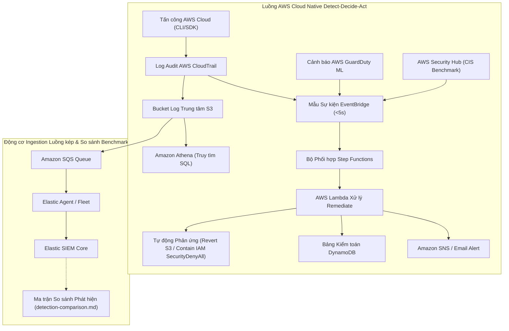

# 5.1 Tổng quan Workshop & Kiến trúc Hệ thống

#### Giới thiệu & Bối cảnh Bài toán

Mặt trận tấn công trên môi trường đám mây doanh nghiệp đang mở rộng nhanh chóng. Kẻ tấn công khai thác các khóa truy cập (Access Keys) bị rò rỉ, cấu hình sai phân quyền IAM và các bucket lưu trữ bị công khai để âm thầm xâm nhập. Vì các lệnh API cloud đơn lẻ (như `ListUsers` hay `PutBucketPolicy`) rất giống với các thao tác quản trị hợp lệ hàng ngày, công tác phòng thủ hiệu quả đòi hỏi phải kết hợp giữa **phát hiện hành vi dựa trên ngữ cảnh (contextual behavioral detection)** và **cảnh báo tự động độ trễ cực thấp**.

Bài workshop này hướng dẫn bạn từng bước xây dựng một phòng thí nghiệm SOC phát hiện tấn công theo luồng kép bằng cả **AWS Management Console** và **Hạ tầng dưới dạng Mã (IaC)** qua Terraform. Hệ thống thu thập dữ liệu giám sát (telemetry) trên cả máy trạm Windows và hạ tầng AWS Cloud, đẩy log vào cụm **Elastic SIEM**, điều hướng cảnh báo ưu tiên cao qua **hệ thống tự động hóa Serverless**, và so sánh đối chiếu giữa các luật phát hiện KQL tùy biến với các dịch vụ an toàn thông tin AWS-native (**AWS GuardDuty** và **IAM Access Analyzer**).

---

#### Bài toán & Mục tiêu Cụ thể

* **Bài toán cần giải quyết**: Luồng thu thập log SIEM theo lô truyền thống thường tạo ra độ trễ từ 5 đến 15 phút trước khi chuyên viên SOC nhận được thông báo về các cuộc tấn công cloud đang diễn ra (như tạo tài khoản backdoor hoặc công khai S3 bucket).
* **Đối tượng hướng tới**: Kỹ sư An toàn thông tin Cloud, Chuyên viên SOC và Kỹ sư Đám mây AWS cần khả năng phản ứng sự cố tự động tức thì kết hợp truy tìm mối đe dọa chuyên sâu.
* **Mục tiêu chính & Kết quả đạt được**:
  1. Xây dựng **luồng AWS-native detect-decide-act (<5 giây)** tích hợp Step Functions orchestration, Lambda tự động xử lý (thu hồi chính sách công khai S3, gán policy `SecurityDenyAll` cô lập tài khoản IAM backdoor) và quản lý tuân thủ Security Hub CIS Benchmark.
  2. Duy trì **luồng telemetry AWS đẩy liên tục qua S3/SQS vào Elastic SIEM** phục vụ so sánh đánh giá benchmark phát hiện.
  3. Thực thi **5 kịch bản tấn công đám mây AWS theo chuẩn MITRE ATT&CK** để xây dựng ma trận so sánh thực nghiệm (`detection-comparison.md`).
  4. Thực thi **Truy tìm Mối đe dọa bằng SQL Athena Native** trực tiếp trên kho log S3 (`athena-hunt-queries.md`).
  5. Đảm bảo tuân thủ nghiêm ngặt **Chính sách Kiểm soát Chi phí Zero-Spend** trên AWS.

---

#### Sơ đồ Kiến trúc Hệ thống Cao cấp

---

#### Lý do Kỹ thuật & Chi phí Lựa chọn Dịch vụ (Rubric 4.2)

Để đáp ứng chính xác tiêu chí đánh giá dự án (Thang điểm 4.2), lý do kỹ thuật và chi phí cho từng dịch vụ AWS được giải thích chi tiết dưới đây:

| Dịch vụ AWS | Vai trò triển khai | Dịch vụ thay thế đã đánh giá | Lý do Lựa chọn (Kỹ thuật & Chi phí) |
| :--- | :--- | :--- | :--- |
| **AWS CloudTrail** | Thu thập Log Audit API Đa Region | Trích xuất API thủ công, VPC Flow Logs | **Nhật ký Kiểm toán Native**: Ghi nhận toàn bộ các lệnh management & data event trên mọi dịch vụ AWS. Miễn phí gói AWS Free Tier cho management events. |
| **Amazon S3** | Kho Lưu trữ Log Trung tâm | Đẩy log trực tiếp qua HTTP đến SIEM | **Độ bền cao & Tách biệt**: Làm landing zone bất biến. Bật mã hóa SSE-S3 tại chỗ với chi phí duy trì $0 khi không có truy xuất lớn. |
| **Amazon SQS** | Hàng chờ Đệm Ingestion & Tách biệt | Đọc trực tiếp từ thông báo S3 | **Giải tỏa Áp lực & Tin cậy**: Tách biệt luồng Elastic Fleet ingestion khỏi S3, tránh mất mát log khi bùng nổ dữ liệu và tự động mở rộng scale. |
| **Amazon EventBridge** | Bộ Điều hướng Sự kiện Tấn công Thời gian thực | Bộ lọc CloudWatch Logs Subscription | **Khớp mẫu dưới 1 giây**: Lọc các sự kiện CloudTrail quan trọng và GuardDuty findings tức thì mà không cần cơ chế polling định kỳ. |
| **AWS Lambda** | Xử lý Cảnh báo Serverless & Gửi Webhook | Máy chủ EC2 chạy worker nhận cảnh báo | **Chi phí Idle = $0 & Tự động Scale**: Chỉ chạy mã xử lý Python khi có sự kiện kích hoạt. Không tốn chi phí duy trì duy trì hạ tầng server. |
| **Amazon DynamoDB** | Cơ sở Dữ liệu Nhật ký Audit Cảnh báo | Cơ sở dữ liệu quan hệ (Amazon RDS) | **Độ trễ thấp & Serverless On-Demand**: Lưu trữ lịch sử cảnh báo và timestamp thực thi với chi phí $0 khi không có truy vấn. |
| **Amazon SNS** | Phân phối Cảnh báo Đa kênh (Fan-out) | Gọi HTTP request trực tiếp từ Lambda | **Khả năng Fan-out**: Cho phép một sự kiện cảnh báo đồng thời đẩy về Discord webhook, email thông báo và hệ thống PagerDuty. |
| **AWS GuardDuty** | Phát hiện Mối đe dọa bằng ML | Tự viết và bảo trì luật thủ công | **Học máy Phát hiện Bất thường**: Phát hiện các hành vi lệch chuẩn (rò rỉ dữ liệu S3, API bất thường). Sử dụng trong chế độ dùng thử 30 ngày free trial. |
| **IAM Access Analyzer** | Phân tích Cấu hình Public Access | Kiểm toán chính sách thủ công | **Chứng minh Logic Tĩnh Tự động**: Liên tục đánh giá các chính sách S3 bucket policy để phát hiện truy cập trái phép từ bên ngoài hoặc tài khoản khác. |

---

#### Nguyên tắc Thiết kế Bảo mật & Phân quyền IAM

1. **Nguyên tắc Quyền Tối thiểu (Least Privilege)**:
   - IAM Execution Role cho Lambda (`soc-lambda-execution-role`) chỉ được cấp chính xác các quyền cần thiết (`dynamodb:PutItem`, `sns:Publish`, `logs:CreateLogGroup`, `logs:PutLogEvents`).
   - Access Policy của SQS Queue giới hạn quyền `sqs:SendMessage` cho duy nhất ARN của CloudTrail S3 bucket thông qua điều kiện `aws:SourceArn`.
2. **Bảo mật Khóa & Thông tin Xác thực**:
   - Tuyệt đối không hard-code Access Key trong mã Terraform, kịch bản Python hay trên GitHub repository.
   - Webhook URL của Discord được truyền qua tham số môi trường (Environment Variables) mã hóa của Lambda.
3. **Bảo vệ Dữ liệu & Mã hóa**:
   - Các S3 Bucket chứa log CloudTrail bắt buộc bật **Server-Side Encryption (SSE-S3)** và cấu hình **Block Public Access**.
   - Mọi kết nối mạng truyền tải dữ liệu đều sử dụng **TLS 1.3**.

---

#### Khả năng Mở rộng & Vận hành Hệ thống

- **Tính Co giãn Event-Driven**: Đường ống tự động hóa Serverless tự động co giãn từ 0 đến hàng ngàn sự kiện/giây mà không cần quản lý máy chủ.
- **Hàng chờ Tách biệt**: SQS đóng vai trò bộ đệm hấp thụ các đợt bùng nổ log CloudTrail lớn, giúp Elastic Agent kéo log êm và không làm quá tải cụm SIEM.
- **Giám sát Vận hành**: Các cảnh báo AWS CloudWatch Alarm liên tục theo dõi lỗi thực thi của Lambda (`Errors > 0`) và tin nhắn trong hàng chờ lỗi SQS Dead-Letter Queue (`ApproximateNumberOfMessagesVisible > 0`).

---

#### So sánh Độ trễ & Khả năng của 2 Đường ống Telemetry

| Thành phần | Đường dẫn Ingestion | Độ trễ | Trường hợp Sử dụng Chính |
| :--- | :--- | :--- | :--- |
| **Tự động hóa Serverless** | CloudTrail / GuardDuty → EventBridge → Lambda → SNS / Discord | **< 10 giây** | Phát cảnh báo tức thì cho các hành vi nguy hiểm cao (tạo backdoor user, công khai S3 policy). |
| **Đường ống Elastic SIEM** | CloudTrail → S3 → SQS → Elastic Agent → Elastic SIEM | **~5 phút** | Phân tích tương quan phức tạp, luật EQL sequence, threat hunting lịch sử và dashboard trực quan. |
| **Telemetry Endpoint** | Sysmon / Suricata → Elastic Agent → Elastic SIEM | **Gần thời gian thực** | Ghi nhận thực thi tiến trình, dump bộ nhớ LSASS, giám sát kết nối mạng. |
