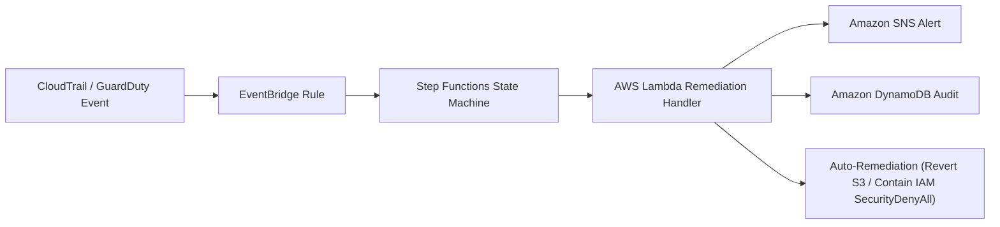

# 5.5 Threat Detection Engineering & Serverless Alerting

#### Overview

In this module, you will configure **Elastic SIEM detection rules**, inspect the **serverless auto-remediation pipeline**, compare detection results against **AWS GuardDuty**, perform **SQL-based threat hunting with Amazon Athena**, and monitor everything through the **Operations Dashboard**.

---

#### 1. Detection & Response Pipeline Architecture

Before diving into individual rules, here is the end-to-end pipeline that connects a CloudTrail event to automated remediation:



The flow works as follows:

1. **CloudTrail** captures API activity across all AWS regions.
2. **EventBridge** pattern rules match high-risk actions (`CreateUser`, `PutBucketPolicy`, etc.) within **< 5 seconds** of occurrence.
3. **Step Functions** orchestrates the response workflow: `Detect → Enrich → Decide → Remediate → Notify → Log`.
4. **Lambda** executes auto-remediation (reverting public S3 policies, attaching IAM `SecurityDenyAll` containment) and persists telemetry to DynamoDB.

In parallel, the same CloudTrail logs are shipped to **Elastic SIEM** via S3 → SQS for KQL-based detection rules (Section 2), and the raw S3 archive remains queryable through **Amazon Athena** as a SIEM-independent fallback (Section 5).

---

#### 2. Elastic SIEM Detection Rules (KQL & Threshold)

These are the 5 custom detection rules deployed in Elastic SIEM, each mapped to an attack scenario from the previous module:

##### Rule 1: Root Account Console Login (Scenario 1)

- **MITRE ATT&CK**: T1078.004 — Valid Accounts: Cloud Accounts
- **Rule Type**: KQL Rule
- **Description**: Fires on any successful root console login. Root has no permission boundary and cannot be restricted by IAM policy — a root login is treated as a high-signal event regardless of context.
- **Severity**: Critical
- **KQL Query**:

  ```kql
  event.dataset: "aws.cloudtrail" AND
  event.action: "ConsoleLogin" AND
  aws.cloudtrail.user_identity.type: "Root" AND
  event.outcome: "success"
  ```

##### Rule 2: IAM Reconnaissance Burst (Scenario 2)

- **MITRE ATT&CK**: T1078.004 — Valid Accounts: Cloud Accounts
- **Rule Type**: KQL Rule
- **Description**: Matches individual IAM/STS read actions (`ListUsers`, `ListRoles`, `ListAttachedUserPolicies`, `GetAccountSummary`, `GetCallerIdentity`). Excludes the `elastic-cloudtrail-reader` service account which legitimately calls these APIs. Burst timing (5 calls in 21 seconds) was confirmed manually in Kibana Discover.
- **Severity**: Medium
- **KQL Query**:

  ```kql
  event.dataset: "aws.cloudtrail" AND
  event.provider: ("iam.amazonaws.com" OR "sts.amazonaws.com") AND
  event.action: (
    "ListUsers" OR "ListRoles" OR "ListAttachedUserPolicies" OR
    "ListPolicies" OR "GetAccountSummary" OR "GetCallerIdentity"
  ) AND
  NOT aws.cloudtrail.user_identity.arn: "*elastic-cloudtrail-reader*"
  ```

##### Rule 3: IAM Persistence via Backdoor Admin User (Scenario 3)

- **MITRE ATT&CK**: T1098 — Account Manipulation
- **Rule Type**: KQL Rule
- **Description**: Detects the `CreateUser` → `AttachUserPolicy` → `CreateAccessKey` chain used to establish a persistent backdoor IAM identity. Excludes Terraform service accounts to avoid self-triggering during IaC provisioning.
- **Severity**: High
- **KQL Query**:

  ```kql
  event.dataset: "aws.cloudtrail" AND
  event.provider: "iam.amazonaws.com" AND
  event.action: ("CreateUser" OR "AttachUserPolicy" OR "CreateAccessKey") AND
  NOT aws.cloudtrail.user_identity.arn: "*terraform*"
  ```

##### Rule 4: S3 Data Exfiltration — Bulk Download (Scenario 4)

- **MITRE ATT&CK**: T1530 — Data from Cloud Storage
- **Rule Type**: Threshold Rule
- **Description**: Groups `GetObject` data events by `source.ip` and alerts when a single origin crosses ≥ 20 events in 5 minutes. A single `GetObject` is normal S3 usage — the volume pattern is what encodes "bulk download" as a rule condition. Requires CloudTrail S3 data event selector to be enabled.
- **Severity**: High
- **Threshold Rule Definition**:

  ```
  Rule type:  Threshold
  Query:      event.dataset: "aws.cloudtrail" and event.action: "GetObject"
  Group by:   source.ip
  Threshold:  >= 20 events in 5 minutes
  ```

##### Rule 5: S3 Bucket Made Public (Scenario 5)

- **MITRE ATT&CK**: T1537 — Transfer Data to Cloud Account
- **Rule Type**: KQL Rule
- **Description**: Covers three distinct ways a bucket can be exposed — policy change, ACL change, or loosening Block Public Access — and matches on the presence of a public principal (`*AllUsers*` or `*Principal*`) in the request parameters regardless of bucket name.
- **Severity**: High
- **KQL Query**:

  ```kql
  event.dataset: "aws.cloudtrail" AND
  event.provider: "s3.amazonaws.com" AND
  event.action: ("PutBucketPolicy" OR "PutBucketAcl" OR "PutPublicAccessBlock") AND
  aws.cloudtrail.request_parameters: (*AllUsers* OR *Principal*)
  ```


---

#### 3. Serverless Auto-Remediation & Pipeline Verification

When an attack triggers an EventBridge pattern rule, the following serverless Python handler executes to format the security payload, execute auto-remediation, send notifications, and persist telemetry to DynamoDB:

##### 3.1 Lambda Auto-Remediation Handler (`lambda_function.py`)

```python
import json
import os
import boto3
import urllib3
from datetime import datetime

http = urllib3.PoolManager()
s3 = boto3.client('s3')
iam = boto3.client('iam')
dynamodb = boto3.resource('dynamodb')
table_name = os.environ.get('DYNAMODB_TABLE_NAME', 'automation-pipeline-events')
table = dynamodb.Table(table_name)

def lambda_handler(event, context):
    print("Received security event:", json.dumps(event))
    detail = event.get('detail', {})
    event_name = detail.get('eventName', 'SecurityFinding')
    user_identity = detail.get('userIdentity', {})
    actor_arn = user_identity.get('arn', 'Unknown Identity')
    user_name = user_identity.get('userName')
    event_time = event.get('time', datetime.utcnow().isoformat())
    remediation_status = "Notify Only"

    # Auto-Remediation Action 1: Revert Public S3 Bucket Policy
    if event_name in ["PutBucketPolicy", "DeleteBucketPolicy"]:
        bucket_name = detail.get('requestParameters', {}).get('bucketName')
        if bucket_name:
            try:
                s3.put_public_access_block(
                    Bucket=bucket_name,
                    PublicAccessBlockConfiguration={
                        'BlockPublicAcls': True,
                        'IgnorePublicAcls': True,
                        'BlockPublicPolicy': True,
                        'RestrictPublicBuckets': True
                    }
                )
                remediation_status = "Auto-Remediated"
                print(f"[REMEDIATED] Public access blocked on S3 bucket: {bucket_name}")
            except Exception as e:
                print(f"[ERROR] S3 Remediation failed: {str(e)}")

    # Auto-Remediation Action 2: IAM Backdoor User Containment (Attach SecurityDenyAll)
    elif event_name in ["CreateUser", "AttachUserPolicy"] and user_name and user_name != "soc-lab-admin":
        try:
            iam.attach_user_policy(
                UserName=user_name,
                PolicyArn="arn:aws:iam::aws:policy/AWSDenyAll"
            )
            remediation_status = "Auto-Remediated"
            print(f"[REMEDIATED] SecurityDenyAll policy attached to rogue IAM user: {user_name}")
        except Exception as e:
            print(f"[ERROR] IAM Containment failed: {str(e)}")

    # Persist Telemetry Record to DynamoDB
    table.put_item(
        Item={
            'event_id': event.get('id', str(datetime.utcnow().timestamp())),
            'event_name': event_name,
            'actor_arn': actor_arn,
            'timestamp': event_time,
            'remediation': remediation_status,
            'status': 'PROCESSED'
        }
    )

    return {'statusCode': 200, 'body': f'Event {event_name} processed successfully'}
```

##### 3.2 Verify Step Functions Execution Graph

1. Open **AWS Step Functions Console** → Select state machine `soc-detection-orchestrator`.
2. Under **Executions**, select the latest execution run.
3. Observe the interactive visual graph: Green blocks confirm successful execution of `Detect → Enrich → Decide → Remediate → Notify → Log`.


##### 3.3 Verify Remediation via DynamoDB Audit & Infrastructure State

To verify that auto-remediation executed successfully without relying on CloudWatch log streams:

**1. Query DynamoDB Telemetry Audit Table**
The Lambda function automatically records all processed security events into DynamoDB. Open **AWS DynamoDB Console** → **Tables** → `automation-pipeline-events` → **Explore items**, or run via AWS CLI:

```bash
aws dynamodb scan --table-name automation-pipeline-events --limit 5
```

Inspect the output item for `'remediation': 'Auto-Remediated'` and `'status': 'PROCESSED'`.

**2. Verify Infrastructure State Directly via AWS CLI**
Verify that the Lambda function successfully executed containment against the target AWS resources:

- **IAM Backdoor User Containment (Scenario 3)**:

  ```bash
  aws iam list-attached-user-policies --user-name backup-svc-acct
  ```

  *Expected Result*: Returns `arn:aws:iam::aws:policy/AWSDenyAll` attached to the user.

- **S3 Public Access Enforcement (Scenario 5)**:

  ```bash
  aws s3api get-public-access-block --bucket soclab-public-test-demo
  ```

  *Expected Result*: Returns `BlockPublicAcls: true`, `BlockPublicPolicy: true`, `RestrictPublicBuckets: true`.

---

#### 4. Comparative Evaluation: GuardDuty vs. Custom SIEM Detection Rules

Now that the detection rules and auto-remediation pipeline are in place, how do our custom KQL rules compare to AWS GuardDuty's managed ML detectors?

##### Detection Methodology & Latency Mechanics

GuardDuty finding types split into two core operational categories, which fundamentally dictate detection timing:

1. **Immediate / Signature-Based Detections:** Evaluate static resource configurations (e.g., public bucket policies). They fire immediately upon log arrival without requiring prior account historical activity.
2. **Anomaly / Baseline-Based Detections:** Use machine learning models to profile normal API activity per identity/resource. They require **7 to 14 days of accumulated operational baseline** before they can reliably flag deviations. In fresh disposable lab environments (~3–4 days active), anomaly detectors remain in a learning state.

> **Strategic Takeaway:** Deterministic KQL rules in Elastic SIEM provide instant, zero-day threat detection for fresh accounts and sandbox environments. GuardDuty's managed ML detectors complement SIEM rules by catching unmodeled behavioral drift in established production accounts.

##### Benchmarking Summary

| Attack Technique | Custom KQL Rule | GuardDuty Finding Type | Custom Rule Latency | GuardDuty Latency | Result |
| :--- | :--- | :--- | :---: | :---: | :--- |
| **T1537 — S3 Bucket Made Public** | `T1537-s3-public-bucket` | `Policy:S3/BucketPublicAccessGranted` | **~4m 12s** | **6m 44s** | ✅ **Both Detected** (Immediate signature evaluation) |
| **T1078.004 — IAM Recon Burst** | `T1078.004-iam-recon-burst` | `Discovery:IAMUser/AnomalousBehavior` | **~9m 29s** | **N/A** | ⚠️ **Kibana Only** (GuardDuty requires 7–14 day baseline) |
| **T1098 — IAM Persistence (Backdoor)** | `T1098-iam-persistence` | `Persistence:IAMUser/UserPermissions` | **~9m 26s** | **N/A** | ⚠️ **Kibana Only** (GuardDuty requires 7–14 day baseline) |
| **T1530 — S3 Bulk Download** | `T1530-s3-bulk-download` | `Exfiltration:S3/AnomalousBehavior` | **~12m 50s** | **N/A** | ⚠️ **Kibana Only** (GuardDuty requires 7–14 day baseline) |

##### Per-Scenario Empirical Breakdown

**Scenario 5: T1537 — S3 Bucket Made Public (Signature-Based)**

- **Triggering API Call:** `PutBucketPolicy` granting public wildcard `*` principal access.
- **Custom Rule Result:** Kibana alert fired at **~4m 12s**.
- **GuardDuty Result:** GuardDuty finding `Policy:S3/BucketAnonymousAccessGranted` generated at **6m 44s**.

| Triggering API Call | Kibana SIEM Alert | GuardDuty Console Finding |
| :---: | :---: | :---: |
|  |  |  |

**Scenario 2: T1078.004 — IAM Reconnaissance Burst (Anomaly-Based)**

- **Triggering API Call:** Rapid enumeration burst (`GetCallerIdentity`, `ListUsers`, `ListRoles`, `GetAccountSummary`).
- **Custom Rule Result:** Kibana threshold rule triggered at **~9m 29s** (5 alerts generated).
- **GuardDuty Result:** `N/A` — GuardDuty `Discovery:IAMUser/AnomalousBehavior` did not fire due to an unestablished ML baseline in the fresh lab account.

| Triggering API Call | Kibana SIEM Alert | GuardDuty Console Status |
| :---: | :---: | :---: |
|  |  |  |

**Scenario 3: T1098 — IAM Persistence via Backdoor Admin User (Anomaly-Based)**

- **Triggering API Call:** `CreateUser` (`backup-svc-acct`) + `AttachUserPolicy` (`AdministratorAccess`).
- **Custom Rule Result:** Kibana sequence rule triggered at **~9m 26s** (3 alerts generated).
- **GuardDuty Result:** `N/A` — GuardDuty `Persistence:IAMUser/UserPermissions` did not fire due to cold-start baseline learning.

| Triggering API Call | Kibana SIEM Alert | GuardDuty Console Status |
| :---: | :---: | :---: |
|  |  |  |

**Scenario 4: T1530 — S3 Data Exfiltration / Bulk Download (Anomaly-Based)**

- **Triggering API Call:** Bulk download of 25 objects via `aws s3 sync`.
- **Custom Rule Result:** Kibana threshold rule triggered at **~12m 50s**.
- **GuardDuty Result:** `N/A` — GuardDuty `Exfiltration:S3/AnomalousBehavior` did not fire due to unlearned volume baseline.

| Triggering API Call | Kibana SIEM Alert |
| :---: | :---: |
|  |  |

##### Qualitative Evaluation Summary

| Criterion | Custom SIEM Rules (Kibana / Elastic) | GuardDuty Managed Detector |
| :--- | :--- | :--- |
| **Detection Transparency** | Fully visible rule logic (KQL query inspectable) | Black-box managed ML models |
| **Tunability & Exclusions** | 100% customizable thresholds & IP/user exclusions | Limited to basic suppression rules |
| **Cold-Start Capability** | **Fires on Day 1** without historical data | Requires 7–14 days of identity baseline training |
| **Operational Overhead** | Requires active rule development and schema tuning | Zero operational maintenance required |
| **Auto-Remediation** | Integrates via Webhooks / SOAR automation | Native integration with EventBridge & Lambda |
| **Detection & Action Latency** | ~5 minutes (S3 → SQS batch polling latency) | **Near-instant** (< 5 seconds via EventBridge & Step Functions) |
| **Coverage Scope** | Endpoint + Cloud hybrid correlation | AWS Cloud infrastructure & API telemetry |
| **Cost Profile** | Dependent on log storage volume in Elasticsearch | **Zero-spend Free Tier** + time-boxed 30-day trials ($0 spend) |

##### Key Engineering Findings

- **AWS-Native System** excels at instant (<5s) automated response, enforcing cloud compliance, and closing vulnerabilities without human intervention.
- **Custom KQL Rules** excel at cross-environment correlation, custom sequence rules, long-term SIEM log retention, and — critically — **firing on Day 1** without requiring a historical baseline.

---

#### 5. Amazon Athena SQL Threat Hunting

> **Resilience & Fallback Note:** If the Elastic log shipping pipeline or SIEM cluster is ever unavailable, Athena provides a native, highly resilient SQL-based investigation path directly over the raw CloudTrail S3 archive without any dependency on external log agents or SIEM infrastructure.

Athena queries run against the AWS Glue Data Catalog table `soc_cloudtrail_db.cloudtrail_logs` pointing directly to the S3 bucket destination (`s3://<cloudtrail-bucket>/AWSLogs/`).

1. Open **Amazon Athena Console** → Select Workgroup: `soc_workgroup`.
2. Ensure database selected is `soc_cloudtrail_db` and table is `cloudtrail_logs`.
3. Run the following saved threat hunting queries in the Query Editor:

##### Query 1: IAM Admin Write Actions (Privilege Escalation & Persistence)

Finds all IAM write and persistence modifications (`CreateUser`, `AttachUserPolicy`, `CreateAccessKey`, `PutUserPolicy`) over the past 30 days grouped by principal and source IP.

```sql
SELECT 
    useridentity.arn AS principal_arn,
    sourceipaddress,
    eventname,
    COUNT(*) AS action_count,
    MIN(eventtime) AS earliest_seen,
    MAX(eventtime) AS latest_seen
FROM "default"."cloudtrail_logs_cloudtrail_soclab_194343789465"
WHERE eventsource = 'iam.amazonaws.com'
  AND eventname IN ('CreateUser', 'AttachUserPolicy', 'CreateAccessKey', 'PutUserPolicy', 'AttachRolePolicy')
  AND parse_datetime(eventtime, 'yyyy-MM-dd''T''HH:mm:ss''Z''') >= current_timestamp - INTERVAL '30' DAY
GROUP BY useridentity.arn, sourceipaddress, eventname
ORDER BY action_count DESC;
```


##### Query 2: Public S3 Bucket Policy Modifications (Data Exposure / Misconfiguration)

Identifies any bucket policy modifications or ACL public access changes where bucket policies were created, edited, or removed.

```sql
SELECT 
    eventtime,
    useridentity.arn AS principal_arn,
    sourceipaddress,
    eventname,
    requestparameters,
    errorcode
FROM "default"."cloudtrail_logs_cloudtrail_soclab_194343789465"
WHERE eventsource = 's3.amazonaws.com'
  AND eventname IN ('PutBucketPolicy', 'DeleteBucketPolicy', 'PutBucketAcl', 'PutPublicAccessBlock')
  AND parse_datetime(eventtime, 'yyyy-MM-dd''T''HH:mm:ss''Z''') >= current_timestamp - INTERVAL '30' DAY
ORDER BY eventtime DESC;
```


##### Query 3: IAM Reconnaissance Burst Detection (5-Minute Window Spike)

Performs SQL-based threshold analysis counting distinct read/recon actions (`List*`, `Get*`, `Describe*`) per principal within 5-minute sliding windows to detect automated discovery scripts.

```sql
SELECT 
    useridentity.arn AS principal_arn,
    date_trunc('minute', parse_datetime(eventtime, 'yyyy-MM-dd''T''HH:mm:ss''Z''')) AS minute_window,
    COUNT(DISTINCT eventname) AS unique_recon_actions,
    COUNT(*) AS total_read_calls
FROM "default"."cloudtrail_logs_cloudtrail_soclab_194343789465"
WHERE (eventname LIKE 'List%' OR eventname LIKE 'Get%' OR eventname LIKE 'Describe%')
  AND parse_datetime(eventtime, 'yyyy-MM-dd''T''HH:mm:ss''Z''') >= current_timestamp - INTERVAL '7' DAY
GROUP BY 
    useridentity.arn, 
    date_trunc('minute', parse_datetime(eventtime, 'yyyy-MM-dd''T''HH:mm:ss''Z'''))
HAVING COUNT(*) >= 15
ORDER BY total_read_calls DESC;
```


---

#### 6. Operations Dashboard (NOC UI)

To monitor pipeline telemetry and remediation status in real time:

##### 6.1 Start FastAPI Backend

Open a terminal window:

```bash
cd backend/
uvicorn app.main:app --reload --port 8000
```

Verify API endpoint output: `http://localhost:8000/api/pipeline/events`

##### 6.2 Start React Operations Frontend

Open a second terminal window:

```bash
cd frontend/
npm run dev
```

Open your browser at `http://localhost:3000/events` to inspect:

- **Remediation Status Badges**: `Auto-Remediated` (Green), `Pending` (Yellow), `Notify Only` (Dark).
- **Dynamic Regional CloudTrail Deep Links**: Click the **CloudTrail** button for any event row — IAM events route dynamically to `us-east-1`, while S3/Lambda events route to `ap-southeast-2` with `EventName=${e.cloudtrail_action}`.


