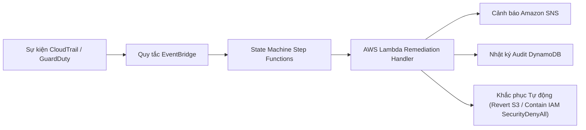

# 5.5 Kỹ thuật Phát hiện Mối đe dọa & Cảnh báo Serverless

#### Tổng quan

Trong phần này, bạn sẽ cấu hình **Các luật phát hiện trên Elastic SIEM**, kiểm tra **Luồng tự động khắc phục serverless**, so sánh kết quả phát hiện với **AWS GuardDuty**, thực hiện **Truy tìm mối đe dọa bằng SQL Amazon Athena**, và giám sát mọi thứ qua **Operations Dashboard**.

---

#### 1. Kiến trúc Luồng Phát hiện & Phản ứng

Trước khi đi vào chi tiết từng luật, đây là luồng end-to-end kết nối một sự kiện CloudTrail đến hành động khắc phục tự động:



Luồng hoạt động như sau:

1. **CloudTrail** ghi lại hoạt động API trên tất cả các region AWS.
2. **EventBridge** pattern rules khớp các hành động rủi ro cao (`CreateUser`, `PutBucketPolicy`, v.v.) trong vòng **< 5 giây** kể từ khi xảy ra.
3. **Step Functions** điều phối luồng phản ứng: `Detect → Enrich → Decide → Remediate → Notify → Log`.
4. **Lambda** thực thi khắc phục tự động (hoàn tác chính sách S3 công khai, gán IAM `SecurityDenyAll` cô lập) và ghi telemetry vào DynamoDB.

Song song, cùng CloudTrail logs được vận chuyển tới **Elastic SIEM** qua S3 → SQS cho các luật phát hiện KQL (Phần 2), và kho S3 gốc vẫn có thể truy vấn qua **Amazon Athena** như đường dẫn dự phòng độc lập SIEM (Phần 5).

---

#### 2. Các Luật Phát hiện trên Elastic SIEM (KQL & Threshold)

Đây là 5 luật phát hiện tùy biến được triển khai trên Elastic SIEM, mỗi luật ánh xạ tới một kịch bản tấn công từ phần trước:

##### Luật 1: Đăng nhập Tài khoản Root vào Console (Scenario 1)

- **MITRE ATT&CK**: T1078.004 — Valid Accounts: Cloud Accounts
- **Loại luật**: Luật KQL
- **Mô tả**: Kích hoạt khi có bất kỳ lần đăng nhập root thành công vào console. Root không có giới hạn quyền và không bị ràng buộc bởi IAM policy — việc đăng nhập root luôn được xem là sự kiện cần cảnh báo cao bất kể bối cảnh.
- **Mức độ nghiêm trọng**: Critical
- **KQL Query**:

  ```kql
  event.dataset: "aws.cloudtrail" AND
  event.action: "ConsoleLogin" AND
  aws.cloudtrail.user_identity.type: "Root" AND
  event.outcome: "success"
  ```

##### Luật 2: Đợt Trinh sát IAM (Scenario 2)

- **MITRE ATT&CK**: T1078.004 — Valid Accounts: Cloud Accounts
- **Loại luật**: Luật KQL
- **Mô tả**: Khớp các hành động đọc IAM/STS riêng lẻ (`ListUsers`, `ListRoles`, `ListAttachedUserPolicies`, `GetAccountSummary`, `GetCallerIdentity`). Loại trừ tài khoản dịch vụ `elastic-cloudtrail-reader` vốn gọi hợp lệ các API này. Tần suất burst (5 lần gọi trong 21 giây) được xác nhận thủ công trong Kibana Discover.
- **Mức độ nghiêm trọng**: Medium
- **KQL Query**:

  ```kql
  event.dataset: "aws.cloudtrail" AND
  event.provider: ("iam.amazonaws.com" OR "sts.amazonaws.com") AND
  event.action: (
    "ListUsers" OR "ListRoles" OR "ListAttachedUserPolicies" OR
    "ListPolicies" OR "GetAccountSummary" OR "GetCallerIdentity"
  ) AND
  NOT aws.cloudtrail.user_identity.arn: "*elastic-cloudtrail-reader*"
  ```

##### Luật 3: Duy trì Truy cập qua Backdoor IAM Admin User (Scenario 3)

- **MITRE ATT&CK**: T1098 — Account Manipulation
- **Loại luật**: Luật KQL
- **Mô tả**: Phát hiện chuỗi `CreateUser` → `AttachUserPolicy` → `CreateAccessKey` dùng để thiết lập IAM identity backdoor. Loại trừ tài khoản Terraform để tránh cảnh báo sai khi IaC provisioning.
- **Mức độ nghiêm trọng**: High
- **KQL Query**:

  ```kql
  event.dataset: "aws.cloudtrail" AND
  event.provider: "iam.amazonaws.com" AND
  event.action: ("CreateUser" OR "AttachUserPolicy" OR "CreateAccessKey") AND
  NOT aws.cloudtrail.user_identity.arn: "*terraform*"
  ```

##### Luật 4: Rò rỉ Dữ liệu S3 — Tải Hàng loạt (Scenario 4)

- **MITRE ATT&CK**: T1530 — Data from Cloud Storage
- **Loại luật**: Luật Threshold
- **Mô tả**: Nhóm các sự kiện `GetObject` theo `source.ip` và cảnh báo khi một nguồn vượt quá ≥ 20 sự kiện trong 5 phút. Một lần `GetObject` đơn lẻ là hành vi S3 bình thường — mẫu khối lượng mới thực sự xác định "tải hàng loạt" làm điều kiện luật. Yêu cầu bật CloudTrail S3 data event selector.
- **Mức độ nghiêm trọng**: High
- **Định nghĩa Luật Threshold**:

  ```
  Rule type:  Threshold
  Query:      event.dataset: "aws.cloudtrail" and event.action: "GetObject"
  Group by:   source.ip
  Threshold:  >= 20 events in 5 minutes
  ```

##### Luật 5: S3 Bucket Bị Công khai (Scenario 5)

- **MITRE ATT&CK**: T1537 — Transfer Data to Cloud Account
- **Loại luật**: Luật KQL
- **Mô tả**: Bao phủ ba cách phơi bày bucket — thay đổi policy, thay đổi ACL, hoặc nới lỏng Block Public Access — và khớp khi request parameters chứa public principal (`*AllUsers*` hoặc `*Principal*`) bất kể tên bucket.
- **Mức độ nghiêm trọng**: High
- **KQL Query**:

  ```kql
  event.dataset: "aws.cloudtrail" AND
  event.provider: "s3.amazonaws.com" AND
  event.action: ("PutBucketPolicy" OR "PutBucketAcl" OR "PutPublicAccessBlock") AND
  aws.cloudtrail.request_parameters: (*AllUsers* OR *Principal*)
  ```


---

#### 3. Khắc phục Tự động Serverless & Kiểm tra Luồng

Khi tấn công kích hoạt quy tắc EventBridge pattern, mã Python serverless sau sẽ thực thi để định dạng cảnh báo, tự động xử lý sự cố, phát thông báo và ghi log audit vào DynamoDB:

##### 3.1 Lambda Auto-Remediation Handler (`lambda_function.py`)

```python
import json
import os
import boto3
import urllib3
from datetime import datetime

http = urllib3.PoolManager()
s3 = boto3.client('s3')
iam = boto3.client('iam')
dynamodb = boto3.resource('dynamodb')
table_name = os.environ.get('DYNAMODB_TABLE_NAME', 'automation-pipeline-events')
table = dynamodb.Table(table_name)

def lambda_handler(event, context):
    print("Received security event:", json.dumps(event))
    detail = event.get('detail', {})
    event_name = detail.get('eventName', 'SecurityFinding')
    user_identity = detail.get('userIdentity', {})
    actor_arn = user_identity.get('arn', 'Unknown Identity')
    user_name = user_identity.get('userName')
    event_time = event.get('time', datetime.utcnow().isoformat())
    remediation_status = "Notify Only"

    # Hành động Auto-Remediation 1: Hoàn tác S3 Bucket Policy Công khai
    if event_name in ["PutBucketPolicy", "DeleteBucketPolicy"]:
        bucket_name = detail.get('requestParameters', {}).get('bucketName')
        if bucket_name:
            try:
                s3.put_public_access_block(
                    Bucket=bucket_name,
                    PublicAccessBlockConfiguration={
                        'BlockPublicAcls': True,
                        'IgnorePublicAcls': True,
                        'BlockPublicPolicy': True,
                        'RestrictPublicBuckets': True
                    }
                )
                remediation_status = "Auto-Remediated"
                print(f"[REMEDIATED] Public access blocked on S3 bucket: {bucket_name}")
            except Exception as e:
                print(f"[ERROR] S3 Remediation failed: {str(e)}")

    # Hành động Auto-Remediation 2: Cô lập Tài khoản IAM Backdoor (Gán SecurityDenyAll)
    elif event_name in ["CreateUser", "AttachUserPolicy"] and user_name and user_name != "soc-lab-admin":
        try:
            iam.attach_user_policy(
                UserName=user_name,
                PolicyArn="arn:aws:iam::aws:policy/AWSDenyAll"
            )
            remediation_status = "Auto-Remediated"
            print(f"[REMEDIATED] SecurityDenyAll policy attached to rogue IAM user: {user_name}")
        except Exception as e:
            print(f"[ERROR] IAM Containment failed: {str(e)}")

    # Ghi Nhật ký Audit Telemetry vào DynamoDB
    table.put_item(
        Item={
            'event_id': event.get('id', str(datetime.utcnow().timestamp())),
            'event_name': event_name,
            'actor_arn': actor_arn,
            'timestamp': event_time,
            'remediation': remediation_status,
            'status': 'PROCESSED'
        }
    )

    return {'statusCode': 200, 'body': f'Event {event_name} processed successfully'}
```

##### 3.2 Kiểm tra Biểu đồ Thực thi Step Functions

1. Mở **AWS Step Functions Console** → Chọn state machine `soc-detection-orchestrator`.
2. Tại mục **Executions**, chọn lượt thực thi mới nhất.
3. Quan sát biểu đồ trực quan: Các khối màu **XANH LÁ** xác nhận luồng thực thi thành công qua các bước `Detect → Enrich → Decide → Remediate → Notify → Log`.


##### 3.3 Xác minh Kết quả Khắc phục qua DynamoDB Audit & Trạng thái Hạ tầng

Để xác minh quá trình tự động xử lý (auto-remediation) đã thực thi thành công mà không cần phụ thuộc vào log stream CloudWatch:

**1. Truy vấn Bảng Audit Telemetry trên DynamoDB**
Hàm Lambda tự động ghi lại tất cả sự kiện an ninh đã xử lý vào DynamoDB. Mở **AWS DynamoDB Console** → **Tables** → `automation-pipeline-events` → **Explore items**, hoặc chạy câu lệnh AWS CLI:

```bash
aws dynamodb scan --table-name automation-pipeline-events --limit 5
```

Kiểm tra bản ghi trả về có trường `'remediation': 'Auto-Remediated'` và `'status': 'PROCESSED'`.

**2. Kiểm tra Trạng thái Hạ tầng Trực tiếp bằng AWS CLI**
Xác minh hàm Lambda đã thực thi hành động cô lập thành công trên tài nguyên AWS mục tiêu:

- **Xác minh Cô lập IAM Backdoor User (Kịch bản 3)**:

  ```bash
  aws iam list-attached-user-policies --user-name backup-svc-acct
  ```

  *Kết quả kỳ vọng*: Trả về chính sách `arn:aws:iam::aws:policy/AWSDenyAll` đã được gán vào user.

- **Xác minh Bật Chặn Công khai S3 Bucket (Kịch bản 5)**:

  ```bash
  aws s3api get-public-access-block --bucket soclab-public-test-demo
  ```

  *Kết quả kỳ vọng*: Trả về `BlockPublicAcls: true`, `BlockPublicPolicy: true`, `RestrictPublicBuckets: true`.

---

#### 4. Đánh giá So sánh: GuardDuty vs. Luật Phát hiện SIEM Tùy biến

Sau khi các luật phát hiện và luồng khắc phục tự động đã sẵn sàng, luật KQL tùy biến so với bộ phát hiện ML managed của AWS GuardDuty như thế nào?

##### Phương pháp Phát hiện & Cơ chế Độ trễ

Các loại finding của GuardDuty chia thành hai nhóm vận hành cốt lõi, quyết định trực tiếp thời gian phát hiện:

1. **Phát hiện Tức thì / Dựa trên Chữ ký:** Đánh giá cấu hình tài nguyên tĩnh (ví dụ: chính sách bucket công khai). Kích hoạt ngay khi log đến mà không yêu cầu dữ liệu lịch sử hoạt động trước đó.
2. **Phát hiện Bất thường / Dựa trên Baseline:** Sử dụng mô hình machine learning để lập hồ sơ hoạt động API bình thường theo từng identity/resource. Yêu cầu **7 đến 14 ngày tích lũy baseline vận hành** trước khi có thể đánh dấu sai lệch một cách đáng tin cậy. Trong môi trường lab dùng một lần (~3–4 ngày hoạt động), các bộ phát hiện bất thường vẫn đang trong trạng thái học.

> **Nhận định Chiến lược:** Luật KQL xác định trong Elastic SIEM cung cấp khả năng phát hiện mối đe dọa ngay lập tức, zero-day cho các tài khoản mới và môi trường sandbox. Bộ phát hiện ML managed của GuardDuty bổ trợ luật SIEM bằng cách bắt các sai lệch hành vi chưa được mô hình hóa trong các tài khoản production đã thiết lập.

##### Tổng hợp Benchmark

| Kỹ thuật Tấn công | Luật KQL Tùy biến | Loại Finding GuardDuty | Độ trễ Luật Tùy biến | Độ trễ GuardDuty | Kết quả |
| :--- | :--- | :--- | :---: | :---: | :--- |
| **T1537 — S3 Bucket Công khai** | `T1537-s3-public-bucket` | `Policy:S3/BucketPublicAccessGranted` | **~4m 12s** | **6m 44s** | ✅ **Cả hai Phát hiện** (Đánh giá chữ ký tức thì) |
| **T1078.004 — Trinh sát IAM** | `T1078.004-iam-recon-burst` | `Discovery:IAMUser/AnomalousBehavior` | **~9m 29s** | **N/A** | ⚠️ **Chỉ Kibana** (GuardDuty yêu cầu baseline 7–14 ngày) |
| **T1098 — IAM Persistence (Backdoor)** | `T1098-iam-persistence` | `Persistence:IAMUser/UserPermissions` | **~9m 26s** | **N/A** | ⚠️ **Chỉ Kibana** (GuardDuty yêu cầu baseline 7–14 ngày) |
| **T1530 — Tải Hàng loạt S3** | `T1530-s3-bulk-download` | `Exfiltration:S3/AnomalousBehavior` | **~12m 50s** | **N/A** | ⚠️ **Chỉ Kibana** (GuardDuty yêu cầu baseline 7–14 ngày) |

##### Phân tích Thực nghiệm Từng Kịch bản

**Kịch bản 5 (Lab 12): T1537 — S3 Bucket Công khai (Dựa trên Chữ ký)**

- **API Call Kích hoạt:** `PutBucketPolicy` cấp quyền truy cập principal công khai `*`.
- **Kết quả Luật Tùy biến:** Kibana alert kích hoạt sau **~4m 12s**.
- **Kết quả GuardDuty:** Finding `Policy:S3/BucketAnonymousAccessGranted` phát sinh sau **6m 44s**.

| API Call Kích hoạt | Cảnh báo Kibana SIEM | Finding GuardDuty Console |
| :---: | :---: | :---: |
|  |  |  |

**Kịch bản 2 (Lab 9): T1078.004 — Đợt Trinh sát IAM (Dựa trên Bất thường)**

- **API Call Kích hoạt:** Đợt quét nhanh (`GetCallerIdentity`, `ListUsers`, `ListRoles`, `GetAccountSummary`).
- **Kết quả Luật Tùy biến:** Kibana threshold rule kích hoạt sau **~9m 29s** (5 cảnh báo).
- **Kết quả GuardDuty:** `N/A` — `Discovery:IAMUser/AnomalousBehavior` không kích hoạt do chưa thiết lập ML baseline trong tài khoản lab mới.

| API Call Kích hoạt | Cảnh báo Kibana SIEM | Trạng thái GuardDuty Console |
| :---: | :---: | :---: |
|  |  |  |

**Kịch bản 3 (Lab 10): T1098 — Duy trì Truy cập qua Backdoor Admin User (Dựa trên Bất thường)**

- **API Call Kích hoạt:** `CreateUser` (`backup-svc-acct`) + `AttachUserPolicy` (`AdministratorAccess`).
- **Kết quả Luật Tùy biến:** Kibana sequence rule kích hoạt sau **~9m 26s** (3 cảnh báo).
- **Kết quả GuardDuty:** `N/A` — `Persistence:IAMUser/UserPermissions` không kích hoạt do đang trong giai đoạn học baseline ban đầu.

| API Call Kích hoạt | Cảnh báo Kibana SIEM | Trạng thái GuardDuty Console |
| :---: | :---: | :---: |
|  |  |  |

**Kịch bản 4 (Lab 11): T1530 — Rò rỉ Dữ liệu S3 / Tải Hàng loạt (Dựa trên Bất thường)**

- **API Call Kích hoạt:** Tải hàng loạt 25 object qua `aws s3 sync`.
- **Kết quả Luật Tùy biến:** Kibana threshold rule kích hoạt sau **~12m 50s**.
- **Kết quả GuardDuty:** `N/A` — `Exfiltration:S3/AnomalousBehavior` không kích hoạt do chưa học baseline khối lượng.

| API Call Kích hoạt | Cảnh báo Kibana SIEM |
| :---: | :---: |
|  |  |

##### Tổng hợp Đánh giá Định tính

| Tiêu chí | Luật SIEM Tùy biến (Kibana / Elastic) | Bộ phát hiện GuardDuty Managed |
| :--- | :--- | :--- |
| **Tính Minh bạch Phát hiện** | Logic luật hoàn toàn rõ ràng (KQL query kiểm tra được) | Mô hình ML black-box managed |
| **Khả năng Tùy biến & Loại trừ** | Tùy biến 100% ngưỡng & loại trừ IP/user | Giới hạn ở suppression rules cơ bản |
| **Khả năng Cold-Start** | **Phát hiện từ Ngày 1** mà không cần dữ liệu lịch sử | Yêu cầu 7–14 ngày huấn luyện baseline identity |
| **Gánh nặng Vận hành** | Yêu cầu phát triển luật và điều chỉnh schema liên tục | Chi phí vận hành bằng 0 |
| **Auto-Remediation** | Tích hợp qua Webhooks / SOAR | Tích hợp native với EventBridge & Lambda |
| **Độ trễ Phát hiện & Phản ứng** | ~5 phút (Độ trễ kéo log S3 → SQS) | **Gần như tức thì** (< 5 giây qua EventBridge & Step Functions) |
| **Phạm vi Bao phủ** | Tương quan lai giữa Endpoint + Cloud | Telemetry hạ tầng & API đám mây AWS |
| **Chi phí Vận hành** | Phụ thuộc vào dung lượng lưu trữ trong Elasticsearch | **Dùng thử Free Tier $0 spend** + gói dùng thử 30 ngày có kiểm soát |

##### Kết luận Kỹ thuật Chính

- **Hệ thống AWS-Native** vượt trội ở khả năng phản ứng tự động tức thì (<5s), thực thi tuân thủ an toàn đám mây và đóng lỗ hổng mà không cần con người can thiệp.
- **Luật KQL Tùy biến** vượt trội ở khả năng tương quan dữ liệu đa môi trường, chuỗi logic tùy biến, lưu trữ log SIEM lâu dài, và — quan trọng — **phát hiện từ Ngày 1** mà không cần baseline lịch sử.

---

#### 5. Truy tìm Mối đe dọa bằng SQL Amazon Athena

> **Ghi chú Khả năng Phục hồi:** Nếu đường ống vận chuyển log của Elastic hoặc cụm SIEM không khả dụng, Athena cung cấp đường dẫn điều tra SQL native có tính khả dụng cao trực tiếp trên kho lưu trữ CloudTrail S3 mà không phụ thuộc vào bất kỳ agent hoặc hạ tầng SIEM bên ngoài nào.

Các truy vấn Athena chạy trên bảng AWS Glue Data Catalog `soc_cloudtrail_db.cloudtrail_logs` trỏ trực tiếp tới S3 bucket (`s3://<cloudtrail-bucket>/AWSLogs/`).

1. Mở **Amazon Athena Console** → Chọn Workgroup: `soc_workgroup`.
2. Đảm bảo Database chọn `soc_cloudtrail_db` và Bảng chọn `cloudtrail_logs`.
3. Chạy các câu lệnh SQL truy tìm mối đe dọa sau trong Query Editor:

##### Truy vấn 1: Hành động Ghi IAM Admin (Leo Quyền & Duy trì Truy cập)

Tìm tất cả các thao tác ghi và duy trì truy cập IAM (`CreateUser`, `AttachUserPolicy`, `CreateAccessKey`, `PutUserPolicy`) trong 30 ngày gần nhất, nhóm theo principal và source IP.

```sql
SELECT 
    useridentity.arn AS principal_arn,
    sourceipaddress,
    eventname,
    COUNT(*) AS action_count,
    MIN(eventtime) AS earliest_seen,
    MAX(eventtime) AS latest_seen
FROM "default"."cloudtrail_logs_cloudtrail_soclab_194343789465"
WHERE eventsource = 'iam.amazonaws.com'
  AND eventname IN ('CreateUser', 'AttachUserPolicy', 'CreateAccessKey', 'PutUserPolicy', 'AttachRolePolicy')
  AND parse_datetime(eventtime, 'yyyy-MM-dd''T''HH:mm:ss''Z''') >= current_timestamp - INTERVAL '30' DAY
GROUP BY useridentity.arn, sourceipaddress, eventname
ORDER BY action_count DESC;
```


##### Truy vấn 2: Sửa đổi S3 Bucket Policy Công khai (Phơi bày Dữ liệu / Cấu hình sai)

Xác định các thay đổi bucket policy hoặc ACL public access nơi bucket policy được tạo, chỉnh sửa, hoặc xóa.

```sql
SELECT 
    eventtime,
    useridentity.arn AS principal_arn,
    sourceipaddress,
    eventname,
    requestparameters,
    errorcode
FROM "default"."cloudtrail_logs_cloudtrail_soclab_194343789465"
WHERE eventsource = 's3.amazonaws.com'
  AND eventname IN ('PutBucketPolicy', 'DeleteBucketPolicy', 'PutBucketAcl', 'PutPublicAccessBlock')
  AND parse_datetime(eventtime, 'yyyy-MM-dd''T''HH:mm:ss''Z''') >= current_timestamp - INTERVAL '30' DAY
ORDER BY eventtime DESC;
```


##### Truy vấn 3: Phát hiện Đợt Trinh sát IAM (Đỉnh trong Cửa sổ 5 phút)

Phân tích ngưỡng bằng SQL, đếm các hành động đọc/trinh sát riêng biệt (`List*`, `Get*`, `Describe*`) theo từng principal trong cửa sổ trượt 5 phút để phát hiện script quét tự động.

```sql
SELECT 
    useridentity.arn AS principal_arn,
    date_trunc('minute', parse_datetime(eventtime, 'yyyy-MM-dd''T''HH:mm:ss''Z''')) AS minute_window,
    COUNT(DISTINCT eventname) AS unique_recon_actions,
    COUNT(*) AS total_read_calls
FROM "default"."cloudtrail_logs_cloudtrail_soclab_194343789465"
WHERE (eventname LIKE 'List%' OR eventname LIKE 'Get%' OR eventname LIKE 'Describe%')
  AND parse_datetime(eventtime, 'yyyy-MM-dd''T''HH:mm:ss''Z''') >= current_timestamp - INTERVAL '7' DAY
GROUP BY 
    useridentity.arn, 
    date_trunc('minute', parse_datetime(eventtime, 'yyyy-MM-dd''T''HH:mm:ss''Z'''))
HAVING COUNT(*) >= 15
ORDER BY total_read_calls DESC;
```


---

#### 6. Operations Dashboard (NOC UI)

Để giám sát luồng telemetry và trạng thái khắc phục theo thời gian thực:

##### 6.1 Khởi chạy FastAPI Backend

Mở một cửa sổ terminal:

```bash
cd backend/
uvicorn app.main:app --reload --port 8000
```

Xác nhận endpoint API: `http://localhost:8000/api/pipeline/events`

##### 6.2 Khởi chạy React Operations Frontend

Mở cửa sổ terminal thứ hai:

```bash
cd frontend/
npm run dev
```

Mở trình duyệt truy cập `http://localhost:3000/events` để quan sát:

- **Badge Trạng thái Remediate**: `Auto-Remediated` (Màu xanh), `Pending` (Màu vàng), `Notify Only` (Màu xanh dương).
- **Deep Links Điều hướng Region CloudTrail Động**: Nhấn nút **CloudTrail** trên mỗi dòng sự kiện — các sự kiện IAM tự động mở `us-east-1`, trong khi sự kiện S3/Lambda mở `ap-southeast-2` kèm tham số `EventName=${e.cloudtrail_action}`.


