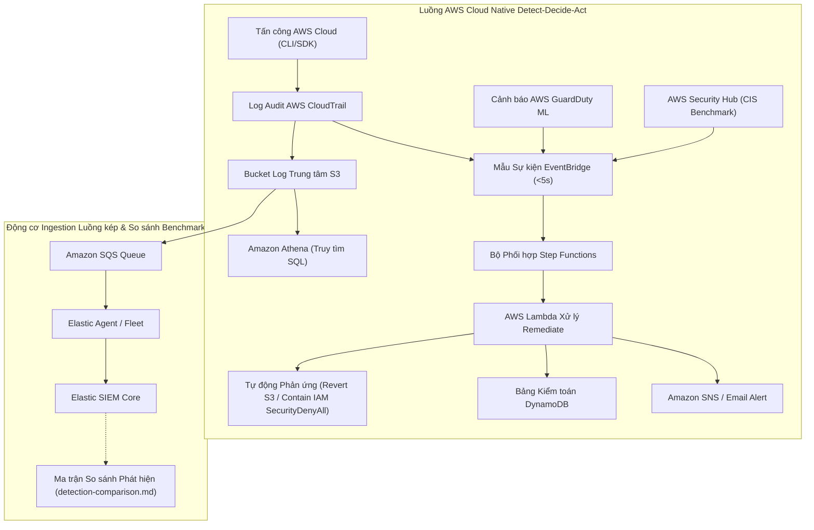

# Xây dựng Hệ thống Giám sát An toàn Thông tin Cloud-Native & SOC Detection Lab

#### Tổng quan

Chào mừng bạn đến với bài thực hành thực tế **Hệ thống Giám sát An toàn Thông tin Cloud-Native & SOC Detection Lab**! Dự án này thể hiện toàn bộ quá trình thiết kế, triển khai và vận hành một nền tảng kỹ thuật phát hiện mối đe dọa (threat detection engineering) chuẩn doanh nghiệp trên hạ tầng đám mây AWS.

Được xây dựng đáp ứng và vượt trên các tiêu chí quy định về báo cáo dự án FCAJ, bài workshop kỹ thuật này cung cấp hướng dẫn chi tiết từng bước để tự tay xây dựng một quy trình thu thập dữ liệu (telemetry), phát hiện tấn công và tự động ứng phó sự cố cho Trung tâm Vận hành An toàn Thông tin (SOC). Bạn sẽ mô phỏng các kỹ thuật tấn công đám mây thực tế được ánh xạ theo khung chuẩn **MITRE ATT&CK**, viết các luật phát hiện hành vi trong **Elastic SIEM (KQL)**, triển khai luồng phối hợp tự động hóa Serverless qua **AWS EventBridge, Step Functions, Lambda, SNS, và DynamoDB**, thực thi **Truy tìm Mối đe dọa bằng SQL Athena Native**, quản lý tuân thủ **AWS Security Hub CIS Benchmark**, cũng như đánh giá các dịch vụ an toàn thông tin AWS-native (**AWS GuardDuty & IAM Access Analyzer**).

---

#### Kiến trúc Mục tiêu & Hệ thống Vận hành

Bài thực hành triển khai luồng phát hiện và ứng phó sự cố native trên AWS kết hợp với khung đánh giá so sánh phát hiện mối đe dọa thực nghiệm:

1. **Luồng AWS Cloud Native Detect-Decide-Act (Hệ thống Chính)**:
   - **CloudTrail API Actions / GuardDuty ML / Security Hub CIS Benchmark → EventBridge → Step Functions State Machine → AWS Lambda → SNS, DynamoDB & Tự động Phản ứng**.
   - Quyết định và phản ứng tự động dưới 5 giây (ví dụ: thu hồi chính sách công khai S3 bucket qua `s3:PutPublicAccessBlock`, cô lập tài khoản IAM backdoor bằng chính sách `SecurityDenyAll`) kết hợp truy tìm mối đe dọa bằng SQL qua **Amazon Athena** và giám sát trên **Ops Dashboard**.

2. **Luồng Ingestion & So sánh Đánh giá SIEM Benchmark**:
   - **CloudTrail → S3 → SQS → Elastic Agent / Fleet → Elastic SIEM**.
   - Dữ liệu telemetry AWS CloudTrail liên tục đẩy vào Elastic SIEM để so sánh đối chiếu giữa dịch vụ bảo mật managed AWS và các luật KQL tùy biến (`detection-comparison.md`).

---

#### Sơ đồ Kiến trúc Hệ thống Tổng quan

---

#### Nội dung bài Workshop

1. **[5.1 Tổng quan Workshop & Kiến trúc](5.1-Workshop-overview/)**: Phân tích chi tiết các thành phần kiến trúc, mô hình mối đe dọa, lý do kỹ thuật & chi phí lựa chọn dịch vụ (Rubric 4.2), thiết kế bảo mật IAM và cơ chế đường ống hai tốc độ.
2. **[5.2 Tiền đề & Chuẩn bị Môi trường](5.2-Prerequiste/)**: Yêu cầu tài khoản, cài đặt công cụ (Terraform, AWS CLI, Python, Elastic Cloud) và thiết lập hạn mức chi phí Zero-Spend Budget.
3. **[5.3 Triển khai Hạ tầng dưới dạng Mã (IaC)](5.3-Deploy-IaC/)**: Tự động hóa khởi tạo CloudTrail, S3, SQS, EventBridge, Step Functions, Lambda, GuardDuty, Security Hub, Athena và DynamoDB bằng kịch bản Terraform HCL.
4. **[5.4 Mô phỏng Tấn công thực tế](5.4-Attack-Simulation/)**: Thực thi 5 kịch bản MITRE ATT&CK cloud API trên AWS (IAM recon, tạo backdoor user, leo thang quyền, sửa policy S3, exfiltration dữ liệu).
5. **[5.5 Phát hiện Mối đe dọa & Cảnh báo Serverless](5.5-Detection-Alerting/)**: Triển khai mã Lambda auto-remediation, kiểm tra Step Functions state machine, truy tìm mối đe dọa bằng SQL Athena (`athena-hunt-queries.md`), giám sát trên Ops Dashboard và so sánh đối chiếu benchmark (`detection-comparison.md`).
6. **[5.6 Dọn dẹp Tài nguyên & Bài học Kinh nghiệm](5.6-Cleanup/)**: Hủy bỏ tài nguyên bằng `terraform destroy`, xác nhận biện pháp kiểm soát chi phí zero-spend, các điểm tùy biến cá nhân, giải quyết khó khăn kỹ thuật thực tế và hướng phát triển (Rubric 4.5).